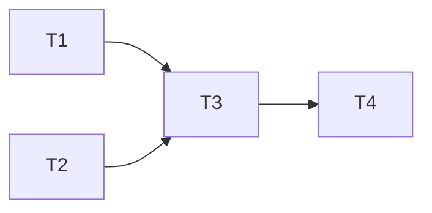

# Manager Agent Canvas: {TASK_NAME}
**Session**: {SESSION_NAME}  
**Created**: {DATE}

## 🎯 **COORDINATION OVERVIEW**

### **Current Mode**: [PLANNER | CONTEXT_MANAGER | ANALYST | INTEGRATOR | MONITOR]

### **Mission Context**
- Lead's Strategic Direction: 
- Total Scope Estimate: ~X tasks
- Critical Constraints:

### **Active Coordination**
```
Phase: [Planning/Execution/Integration]
Focus: [Current coordination priority]
```

---

## 📊 **TASK MANAGEMENT**

### **Task Breakdown**
| ID | Task | Type | Size | Priority | Status | Assigned |
|----|------|------|------|----------|--------|----------|
| T1 | | [Analysis/Code/Debug/Research] | S/M/L | High/Med/Low | Planning | @worker |
| T2 | | | | | | | |

### **Chunk Planning**
```
Chunk 1: [Description]
- File/Task 1
- File/Task 2
- File/Task 3

Chunk 2: [Description]
- File/Task 4
- File/Task 5
```

### **Dependencies**


---


## 🔄 **MODE-SPECIFIC WORKSPACE**

### **PLANNER Mode**
- Strategy Interpretation:
- Task Decomposition:
- Prioritization Logic:

### **CONTEXT_MANAGER Mode**
- Information Gathered:
- Context Prepared:
- Worker Briefing:

### **ANALYST Mode**
- Outputs Reviewed:
- Patterns Found:
- Integration Points:

### **INTEGRATOR Mode**
- Synthesis Strategy:
- Cross-references:
- Final Assembly:

### **MONITOR Mode**
- Performance Metrics:
- Quality Observations:
- Process Improvements:

---

## 📋 **ASSIGNMENT LOG**

### **Active Assignments**
```markdown
Assignment #X - [TIME]
To: @worker (ANALYST type)
Task: "Analyze authentication flow"
Context: [Relevant files and patterns to look for]
Status: 🔄 Active
```

### **Completed Assignments**
```markdown
Assignment #X - COMPLETE
Worker Output: [Summary]
Quality: [Excellent/Good/Needs Work]
Key Findings: [Important discoveries]
Next Step: [Follow-up needed]
```

---

## 🧩 **INTEGRATION TRACKING**

### **Synthesis Progress**
- [ ] Worker outputs collected
- [ ] Cross-references identified
- [ ] Patterns synthesized
- [ ] Gaps identified
- [ ] Final structure created

### **Integration Map**
```
Worker Output 1 → Section A of final deliverable
Worker Output 2 → Section B + cross-ref to A
Worker Output 3 → New insights for Section C
```

---

## 💡 **ADAPTIVE INSIGHTS**

### **Process Optimizations**
- Optimization 1: [How to improve]
- Optimization 2: [Efficiency gain]

### **Lessons Learned**
- Task sizing: [What worked]
- Context prep: [What helped]
- Worker coordination: [Best practices]

---

## 📈 **METRICS & ANALYSIS**

### **Efficiency Metrics**
- Tasks Completed: X/Y
- Rework Required: X tasks
- Time to Complete: X hours

### **Quality Observations**
- Worker 1: [Performance notes]
- Worker 2: [Performance notes]
- Integration: [Smoothness rating]

---

## 🔄 **NEXT ACTIONS**
1. Immediate: 
2. After worker completes:
3. For integration:

---

**Remember**: Focus on logical task chunking and coordination. Update session file with progress.